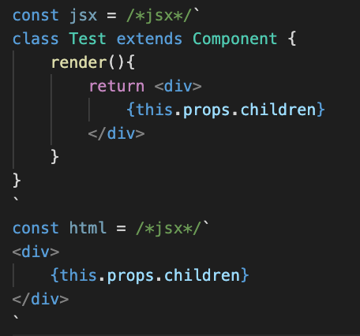

# ES6 String HTML 
> [VSCode Marketplace](https://marketplace.visualstudio.com/items?itemName=Razio.es6-string-jsx)

Adds syntax highlight support for code, placed in es6 multiline strings:
- JSX

## Installation

- Install `es6-string-jsx` from extensions (`ctrl + shift + x`)

## Example



## Usage

```jsx
const jsx = /*jsx*/`
class Test extends Component {
    render(){
        return <div>
            {this.props.children}
        </div>
    }
}
`
const html = /*jsx*/`
<div>
    {this.props.children}
</div>
`
```